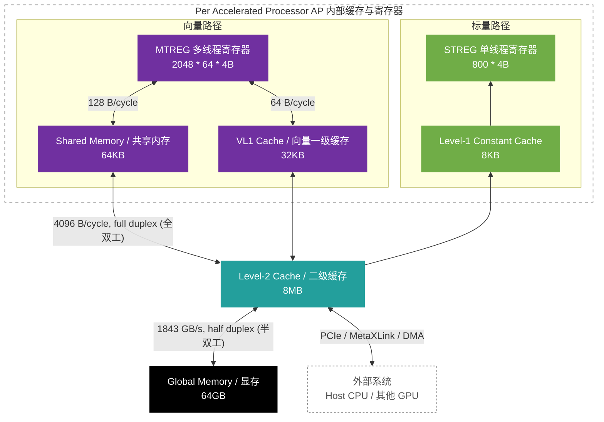
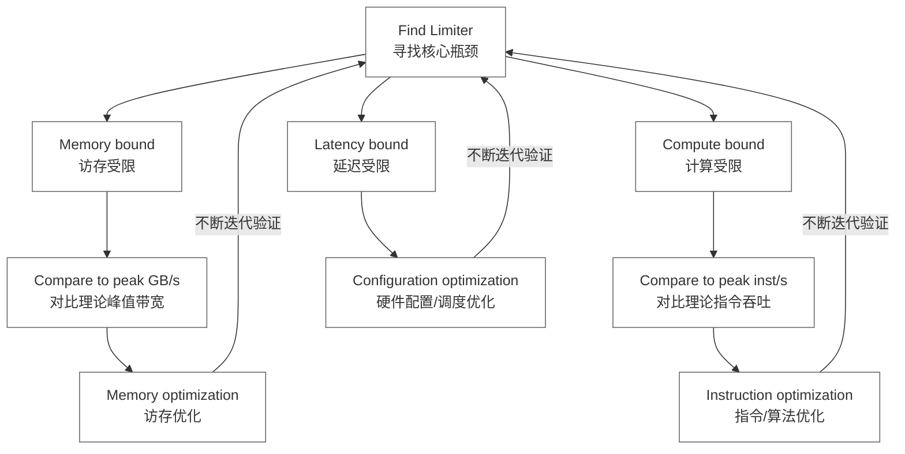

| **FLOP/Cycle**        | **某款主流GPU (参考A100)**             | **曦云某款产品 (MetaX C500)**         |
| --------------------- | -------------------------------------- | ------------------------------------- |
| **#SM/AP (个)**       | 108                                    | 104                                   |
| **标量执行单元/AP**   | N/A                                    | 1                                     |
| **向量执行单元/AP**   | 64                                     | 64                                    |
| **矩阵执行单元/AP**   | 4                                      | 4                                     |
| **FP32向量/AP**       | 128                                    | 可通过测试集获得指令吞吐              |
| **FP32矩阵/AP**       | N/A                                    | 可通过测试集获得指令吞吐              |
| **FP16(BF16)矩阵/AP** | 2048                                   | 可通过测试集获得指令吞吐              |
| **INT8矩阵/AP**       | 4096                                   | 可通过测试集获得指令吞吐              |
| **INT4矩阵/AP**       | 8192                                   | N/A                                   |
| **共享内存/AP**       | 0~164KB                                | 64KB                                  |
| **向量寄存器堆/AP**   | 4 SMSP * 512 reg/t * 32 t * 4B = 256KB | 4 PEU * 512 reg/t * 64 t * 4B = 512KB |

| 硬件层级指标  | 参数项                    | 某款主流GPU (参考A100)                     | 曦云某款产品 (MetaX)                      |
| :------------ | :------------------------ | :----------------------------------------- | :---------------------------------------- |
| **主存结构**  | **显存 (Global Memory)**  | 80GB                                       | 64GB                                      |
|               | **理论 DRAM-L2 带宽**     | 1950 GB/s                                  | 1843 GB/s                                 |
|               | **Host-HBM (单向带宽)**   | 32 GB/s                                    | 64 GB/s                                   |
| **二级缓存**  | **L2 Cache 容量**         | 40MB                                       | 8MB                                       |
|               | **L2-L1 带宽**            | 5120 Byte/cycle                            | 4096 Byte/cycle                           |
| **一级/共享** | **共享内存 (Shared Mem)** | 0~164KB(与L1动态划分)                      | 64KB(固定)                                |
|               | **L1D 容量**              | 16~192KB                                   | 32KB*                                     |
|               | **L1C 容量**              | 8KB (Vector)                               | 8KB (Scalar)                              |
|               | **Shared-MTREG 带宽**     | 128 Byte/cycle                             | 128 Byte/cycle                            |
|               | **L1-MTREG 带宽**         | 128 Byte/cycle                             | 64* Byte/cycle                            |
| **寄存器堆**  | **向量寄存器堆 / AP**     | 4 SMSP * 512 reg/t * 32 t * 4B = **256KB** | 4 PEU * 512 reg/t * 64 t * 4B = **512KB** |
|               | **标量寄存器堆 / AP**     | Unknow (uniform)                           | 800 * 4B                                  |

C500的L1不具备传统意义上的数据复用功能， 它负责将Wave内的请求合并成一个大请求，节省总线带宽。

## C500 关键约束

*从 macainfo 摘出与算子相关的硬件口径*

### 核心参数

- **AP / card**: 104（对应 NCU 的 SM）
- **Wavefront size**: 64（对应 NCU 的 warp）
- **Max waves / AP**: 32
- **Group memory**: 64 KB（**关键约束项**）SMEM 一行 128Bytes = 32 Banks * 4Bytes

### 指标详情表

| **指标**                         | **值**          |
| -------------------------------- | --------------- |
| **Max work-items / AP** (Thread) | 2048            |
| **Max workgroup size** (Block)   | 1024            |
| **L1 / L2**                      | 32 KB / 8192 KB |

GPU访存一次最小为32Bytes，所以为了内存连续性和节省带宽需要合并访存

SMEM Bank大小4Bytes

8个DPC 每个DPC 13个AP 一个AP4个PEU，block调度到AP上，wave调度到PEU上

一条指令一般4个cycle，所以wave会拆成4组每组16线程，4cycle轮转。

